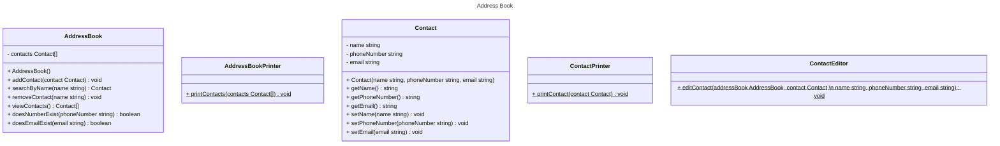

# Address Book Class Diagram

```mermaid
---
title: Address Book
---

classDiagram
    class AddressBook {
        - contacts Contact[]
        + AddressBook()
        + addContact(contact Contact) void
        + searchByName(name string) Contact
        + removeContact(name string) void
        + viewContacts() Contact[]
        + doesNumberExist(phoneNumber string) boolean
        + doesEmailExist(email string) boolean
    }
    class AddressBookPrinter {
        + printContacts(contacts Contact[])$ void
    }
    class Contact {
        - name string
        - phoneNumber string
        - email string
        + Contact(name string, phoneNumber string, email string)
        + getName() string
        + getPhoneNumber() string
        + getEmail() string
        + setName(name string) void
        + setPhoneNumber(phoneNumber string) void
        + setEmail(email string) void
    }
    class ContactPrinter {
        + printContact(contact Contact)$ void
    }
    class ContactEditor {
        + editContact(addressBook AddressBook, contact Contact,\n name string, phoneNumber string, email string)$ void
    }
```